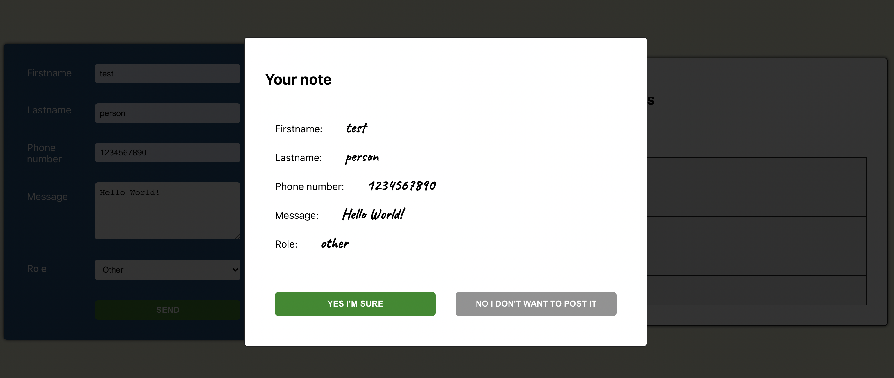

# Forms App

- A forms exercise done with React @ Business College Helsinki - React course

## Description

- Has input fields for:
  - firstname
  - lastname
  - phone number
  - message
  - role
- The inputs are rendered in the view dynamically when user types
  - using onChange
- Has a popup window when form is submitted
  - Shows the data user has inputted
- JSON server also used to store notes

## Screenshots

### Screenshot of Forms App

### Screenshot of pop up window

